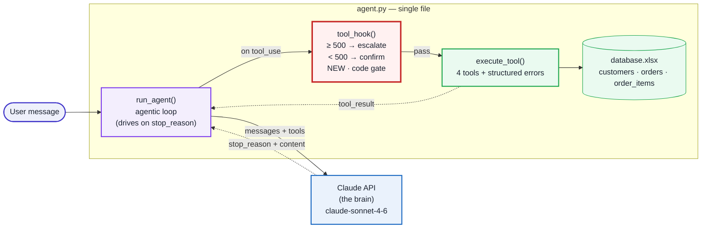

# Multi-Tool Support Agent with Escalation Logic

An **AI agent** that reads a customer's natural-language message, decides on its own which
tools to call, and **escalates to a human** when it must not act automatically. Built as a
**manual agentic loop** with the Anthropic Claude API — no framework — plus a small Flask
web chat UI.

> A learning project (CCA-F Preparation Exercise 1). Data is mocked; the point is to write
> an agent's inner mechanics *by hand* and understand them.

---

## Architecture



Three layers, all in `agent.py`:

1. **LLM (brain)** — the Claude API decides *which* tool to call. Stateless: the full
   conversation is resent every turn.
2. **Loop (orchestration)** — `run_agent()` applies the decision, runs tools, feeds results
   back, and drives the loop via `stop_reason`. **We control it, not the LLM.**
3. **Tools + data (hands)** — `execute_tool()` over a mock Excel database (`database.xlsx`:
   `customers`, `orders`, `order_items`). `lookup_order` joins an order with its line items
   and derives the total `amount = Σ(qty × unit_price)`. Real-world: a DB or MCP server.

The loop repeats until `stop_reason == "end_turn"`. A full styled diagram is in
[`architecture.html`](architecture.html).

---

## Three Core Concepts

**`stop_reason` — the only stop signal.** Every Claude response says *why* it stopped:
`"tool_use"` → continue the loop; `"end_turn"` → stop. The loop is driven only by this
field, never by parsing the reply text.

**`tool_use` — a request, not an execution.** Claude returns a block with `id`, `name`,
`input`, but does **not** run the tool. *You* run it and return a `tool_result` matched by
`tool_use_id`. The tools are the ones you define and code; Claude only picks from your list.

**`hook` — a deterministic guardrail.** Code that runs *before* a tool executes. Here every
`process_refund` is gated by tool name (100% deterministic): **≥ 500 escalates to a human,
< 500 asks the user to confirm**. Enforced in code, not the prompt — because a prompt can be
ignored, code cannot. This is the key architectural lesson: *critical business rules belong
in code, not the prompt.*

---

## What It Does

A customer-support agent. Examples:

- *"Status of order ORD-987?"* → looks up the order and its line items (products, quantities,
  prices, total) and answers.
- *"Refund 400 on ORD-987."* → the gate asks the user to confirm → *yes* processes it.
- *"Refund 900 on ORD-654."* → ≥ 500 → **escalates to a human**.
- *"Tell me the status **and** refund it."* → decomposes both into one combined reply.

If the model ever mis-routes a status query into a refund, the confirmation gate asks first —
so money never moves without the user's "yes".

It combines three CCA-F domains: agentic loop (Domain 1), tool design with boundary-separated
descriptions (Domain 2), and structured errors + retry + guardrails (Domain 5). The two new
ideas are the **programmatic hook** and **multi-concern decomposition**.

---

## Run It

```bash
python -m venv .venv && source .venv/bin/activate    # Windows: .venv\Scripts\activate
pip install -r requirements.txt
python create_database.py                             # build the mock database.xlsx (once)
export ANTHROPIC_API_KEY="sk-ant-..."                 # or place it in a .env file

python agent.py        # terminal: runs the multi-concern scenarios
python app.py          # web chat UI at http://localhost:5050
```

In the **web UI** the refund confirmation happens *in the chat*: for a refund under 500 the
agent replies "Confirm refund? (yes/no)" and waits for your next message (a two-turn
human-in-the-loop). The core agent logic is unchanged — the web layer only adds a
`confirm_callback` so the hook can ask over chat instead of the terminal `input()`.

> Port is **5050**, not 5000 — on macOS port 5000 is taken by the AirPlay Receiver.

### Sample output (live, `claude-sonnet-4-6`)

```
USER:  Hi, I'm CUST-123. (1) status of ORD-987?  (2) a 900 refund on ORD-654.
       stop_reason: tool_use → tool_use → tool_use → end_turn
AGENT: Order ORD-987 — Delivered (Wireless Mouse ×2 @ $50, Keyboard ×1 @ $150, total $250).
       Your $900 refund on ORD-654 was escalated — ticket ESC-001.
```

All four mechanics fire together: the `stop_reason` loop, multi-concern decomposition, the
confirm/escalate hook, and (with ORD-FLAKY) a transient-error retry.

---

## Anti-Patterns Avoided

| Anti-pattern | The right way |
|---|---|
| Enforce a business rule via the prompt | Gate it in code (the hook) |
| Drive the loop by inspecting `content` | Use `stop_reason` |
| Generic "an error occurred" | Structured error (`errorCategory` + `isRetryable`) |
| Retry every error | Retry only transient + `isRetryable` |
| Vague tool descriptions | Boundary sentences (read vs. side-effect) |
| Tool results in separate user messages | All `tool_result` in one user message |
| Use a `tool_runner` helper | Write a manual loop (needed for the hook) |

---

> The same confirm/escalate guardrail maps onto a BMS command agent — a routine command asks
> the operator to confirm; an over-threshold current/voltage command escalates for human
> oversight.
